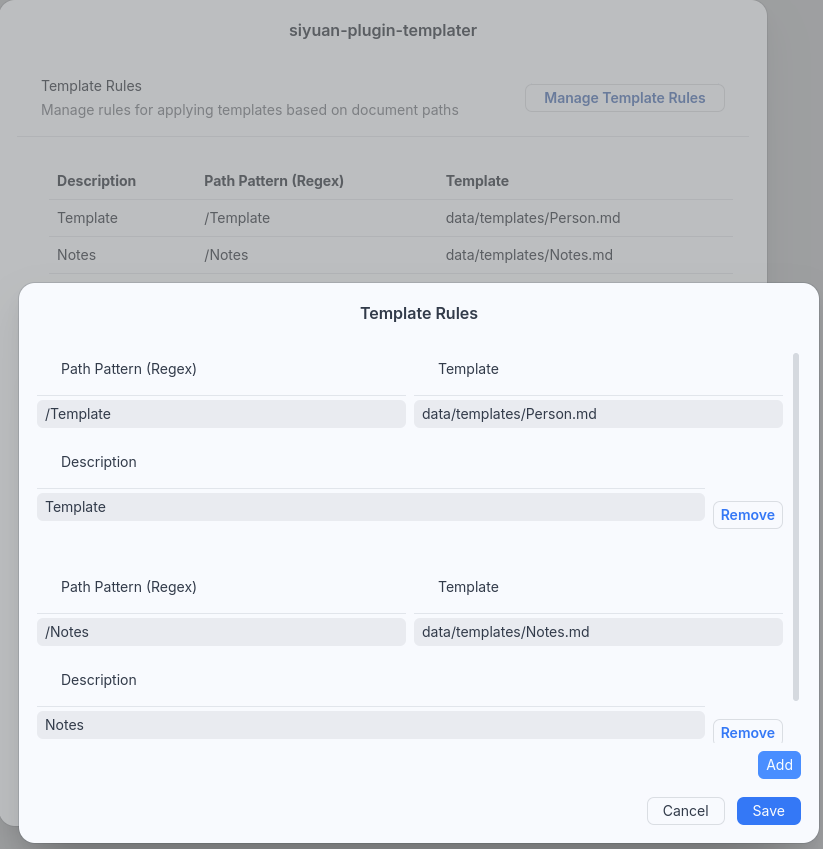

[English](https://github.com/hogmoff/siyuan-plugin-templater/blob/main/README.md)

# 思源插件模板



## 概述
该插件用于处理创建路径中的模板依赖关系。

## 功能
- 在设置中管理规则
- 根据路径作为 regex 应用不同的模板
- 支持工作区模板文件夹中的任何标记模板
- 将文件移至特定文件夹（支持日期格式模板变量，如/Meeting/{{now | date “2006/01”}}/{{now | date “2006-01-02”}})

## 安装
要安装插件，请从思源插件市场下载，或克隆源并将其添加到您的思源插件文件夹中。

### 克隆源并构建
``` bash
git clone https://github.com/hogmoff/siyuan-plugin-templater.git
cd siyuan-plugin-templater
npm install
npm run build
```

## 使用方法
要使用该插件，请在思源设置中启用它，然后在设置中添加规则。保存后，新规则将显示在列表中。

### 模板路径
设置相对于工作区的模板路径（例如 data/templates/example.md）

### 保存路径
如果需要渲染模板的特定目标位置，请设置保存路径。
如果该字段为空，则将在当前路径上创建文档，并询问文档名称。保存路径支持每日备注中的日期格式模板变量。不会创建现有路径。

#### 示例
>“/Meeting/{{now | date ”2006/01“}}/Meeting {{now | date ”2006-01-01“}} 在文件夹 ”/Meeting/20xx/xx/“中创建一个新文档，名称为 ”Meeting 20xx-xx-xx"（今天的日期）。

## 可用语言
- 英语
- 中文（机器翻译）
- 德语

如果要添加或编辑语言文件，请向项目添加英文拉取请求。

## 限制
- 笔记本之间无差异。
- 仅在桌面版和网页版中测试。
- 兼容性可能因思源版本而异。

## 图片
[Icon from Freepik](https://de.freepik.com/icon/wegweiser_3501183#fromView=family&page=1&position=51&uuid=446d41f8-5f18-4105-a681-b4447b91efe7)


## 外部资源链接
特别感谢相关开源项目的贡献者和维护者：
- https://github.com/SilentVoid13/Templater

通过DeepL.com（免费版）翻译
